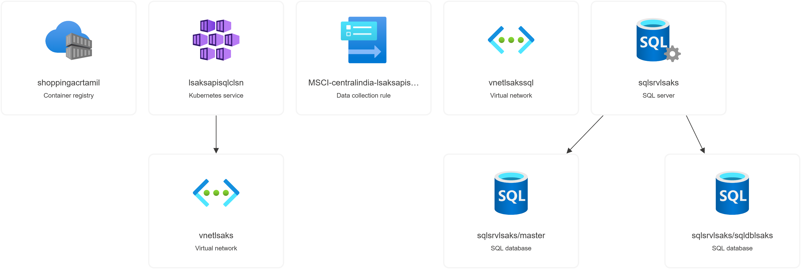
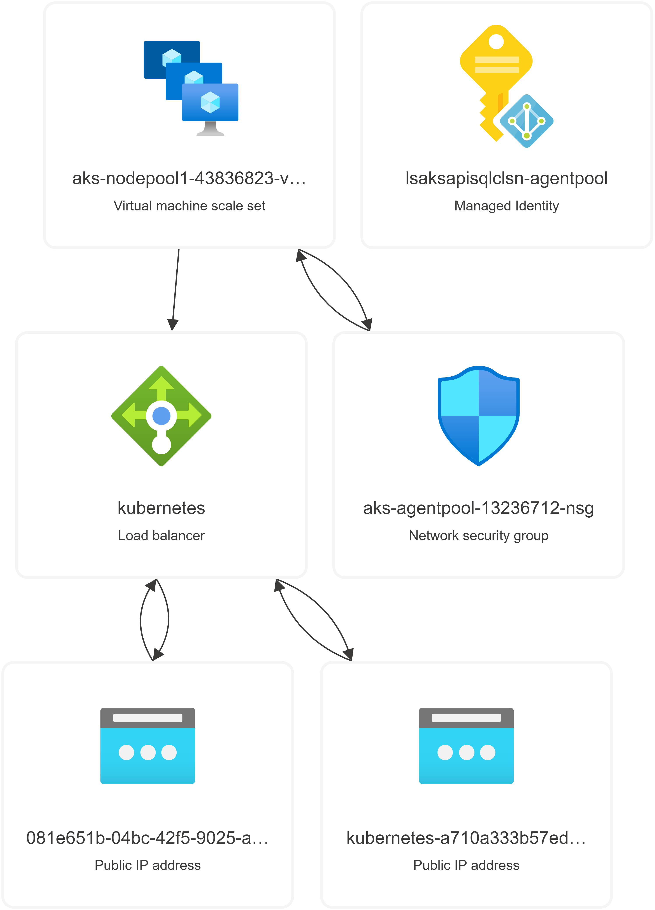

# Azure Kubernetes Service(AKS)

AKS Cluster Creation with in VNet, deploy micorservice and Connect to SQL DB in different VNet using Private Link Service

Refer: [aks-end-to-end-sql](https://github.com/tamilarasusaravanakangeyan/aks/tree/main/aks-end-to-end-sql)

