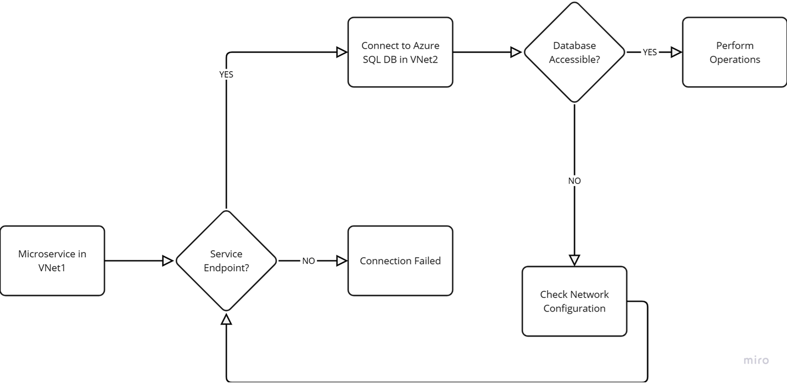
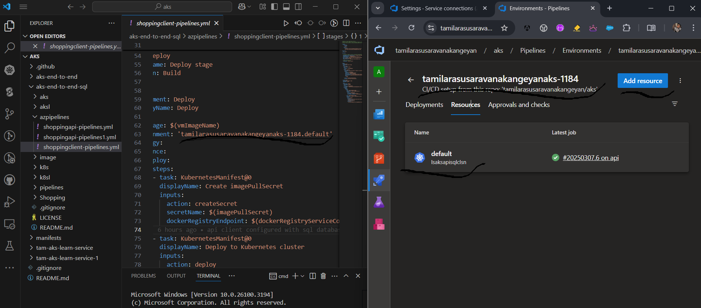
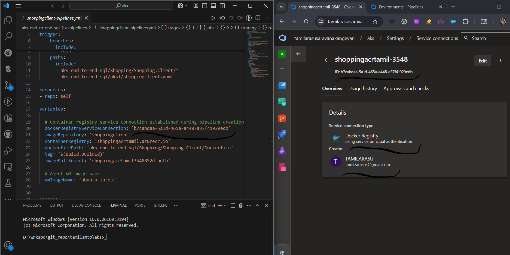
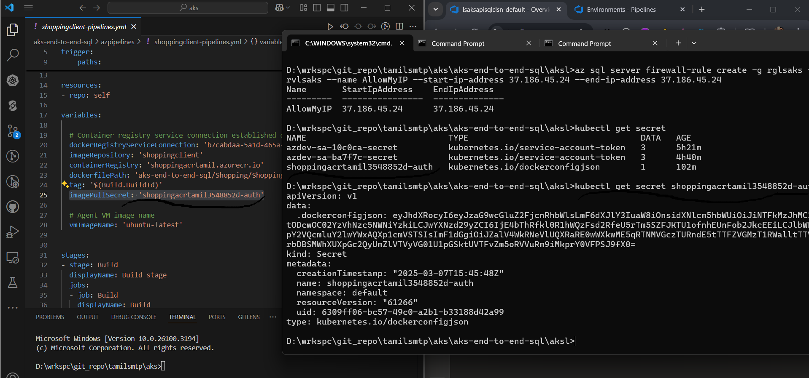
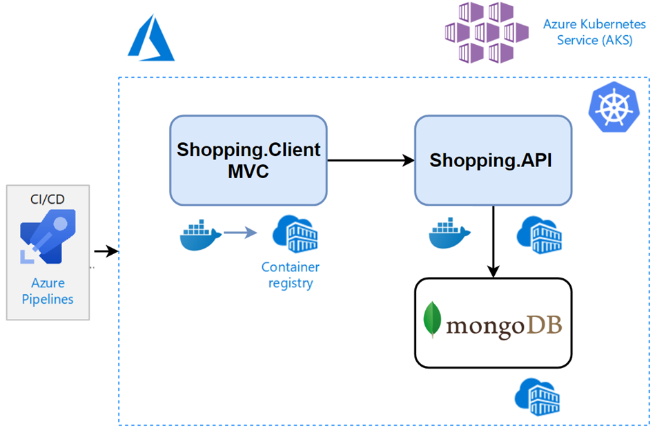
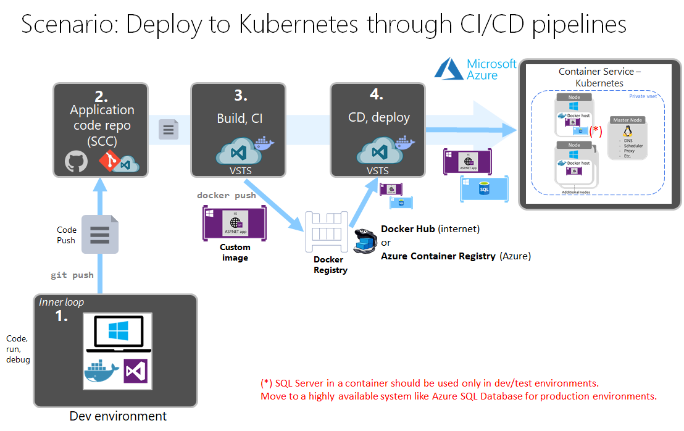

# Deploying .Net Microservices with sql database to Azure Kubernetes Services(AKS) and Automating with Azure DevOps
Deploying .Net Microservices into Kubernetes, and moving deployments to the cloud Azure Kubernetes Services (AKS) with using Azure Container Registry (ACR) and how to Automating Deployments with Azure DevOps and GitHub.


Create Resource Group:
```
az group create -n rglsaks --location centralindia
```


Create Vnet & Subnet:
```
az network vnet create -g rglsaks -n vnetlsakssql --address-prefix 10.0.0.0/8 --subnet-name subnetlsakssql --subnet-prefix 10.240.0.0/16
```


Create SQL Server:
```
az sql server create -n sqlsrvlsaks -g rglsaks --location centralindia --admin-user lsaksadmin --admin-password lsakspassword@25
```


Create SQL DB(Free Tier):
# az sql db create -g rglsaks --server sqldblsaks --name subnetlsakssql --service-objective S0
```
az sql db create -g rglsaks --server sqlsrvlsaks --name sqldblsaks --edition GeneralPurpose --family Gen5 --compute-model Serverless --capacity 1 --auto-pause-delay 60
```


Link Service end point with Subnet
```
az network vnet subnet update --name subnetlsakssql --vnet-name vnetlsakssql -g rglsaks --service-endpoints Microsoft.sql
```


Create Vnet rule:
```
az sql server vnet-rule create -g rglsaks --server sqlsrvlsaks --name vnetrulelsaks --vnet-name vnetlsakssql --subnet subnetlsakssql
```


Check SQL DB:
```
az sql db show -g rglsaks --server sqlsrvlsaks --name sqldblsaks
```


Show SLQ DB Connection String:
```
az sql db show-connection-string --name sqldblsaks --server sqlsrvlsaks --client ado.net
```


Create Sql Server Firewall rule to allow local laptop/specific device to connect the database:
```
az sql server firewall-rule create -g rglsaks --server sqlsrvlsaks --name AllowMyIP --start-ip-address 37.186.45.24 --end-ip-address 37.186.45.24
```


Entity Framework to create DB Tables:
```
dotnet ef migrations add MigrateProductModel
```


```
dotnet ef database update --connection "Server=tcp:sqlsrvlsaks.database.windows.net,1433;Initial Catalog=sqldblsaks;Persist Security Info=False;User ID=lsaksadmin;Password=lsakspassword@25;MultipleActiveResultSets=False;Encrypt=true;TrustServerCertificate=False;Connection Timeout=30;"
```


Create New Vnet:
```
az network vnet create -g rglsaks --name vnetlsaks --address-prefix 10.0.0.0/8 --subnet-name subnetlsaks --subnet-prefix 10.240.0.0/16
```


Check VNet:
```
az network vnet list -g rglsaks
```


Check Subnet:
```
az network vnet subnet show -g rglsaks --vnet-name vnetlsaks --name subnetlsaks --query id -o tsv
```


Create AKS Cluster within VNet
```
az aks create -g rglsaks -n lsaksapisqlclsn --node-count 1 --enable-addons monitoring --generate-ssh-keys --network-plugin azure --vnet-subnet-id "/subscriptions/2a4cc828-64a6-4168-ac96-cea7049e3c12/resourceGroups/rglsaks/providers/Microsoft.Network/virtualNetworks/vnetlsaks/subnets/subnetlsaks"
```


Create Azure Container registry
```
az acr create -g rglsaks --name shoppingacrtamil --sku basic
```


Config Map(can be automated in pipeline)Before Triggering Deployment Need to create config map:
```
D:\aks\aks-end-to-end-sql\aksl>kubectl apply -f shoppingapi-configmap.yaml
```








| Image | Status |
| ------------- | ------------- |
| Shopping Client | [](https://tamilarasusaravanakangeyan.visualstudio.com/aks/_build/latest?definitionId=8&branchName=main) |
| Shopping API | [](https://tamilarasusaravanakangeyan.visualstudio.com/aks/_build/latest?definitionId=7&branchName=main) |

### Overall Picture
See the overall picture. You can see that we will have 3 microservices which we are going to develop and deploy together.



### Shopping MVC Client Application
First of all, we are going to develop Shopping MVC Client Application For Consuming Api Resource which will be the Shopping.Client Asp.Net MVC Web Project. But we will start with developing this project as a standalone Web application which includes own data inside it. And we will add container support with DockerFile, push docker images to Docker hub and see the deployment options like “Azure Web App for Container” resources for 1 web application.
### Shopping API Application
After that we are going to develop Shopping.API Microservice with MongoDb and Compose All Docker Containers.
This API project will have Products data and performs CRUD operations with exposing api methods for consuming from Shopping Client project.
We will containerize API application with creating dockerfile and push images to Azure Container Registry.
### Mongo Db
Our API project will manage product records stored in a no-sql mongodb database as described in the picture.
we will pull mongodb docker image from docker hub and create connection with our API project.
At the end of the section, we will have 3 microservices whichs are Shopping.Client — Shopping.API — MongoDb microservices.
As you can see that, we have
* Created docker images,
Compose docker containers and tested them,
Deploy these docker container images on local Kubernetes clusters,
Push our image to ACR,
Shifting deployment to the cloud Azure Kubernetes Services (AKS),
Update microservices with zero-downtime deployments.
### Deploy to Azure Kubernetes Services (AKS) through CI/CD Azure Pipelines
And the last step, we are focusing on automation deployments with creating CI/CD pipelines on Azure Devops tool. We will develop separate microservices deployment pipeline yamls with using Azure Pipelines.
When we push code to Github, microservices pipeline triggers, build docker images and push the ACR, deploy to Azure Kubernetes services with zero-downtime deployments.



You’ll see how to deploy your multi-container microservices applications with automating all deployment process seperately.
